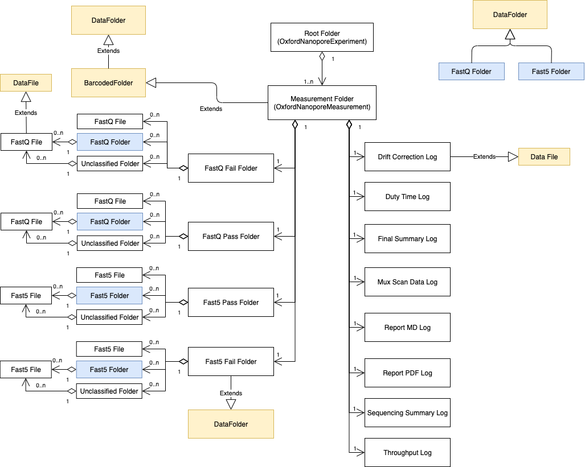

# Data Model Library
[](https://travis-ci.com/qbicsoftware/data-model-lib)[](https://codecov.io/gh/qbicsoftware/data-model-lib)

Data Model Library, version 1.0.0-SNAPSHOT - A collection of QBiC data models.

## Author
Created by Andreas Friedrich, Luis de la Garza, Sven Fillinger.

## How to Install

With Maven you can include the library as dependency with:

```
<dependency>
  <groupId>life.qbic</groupId>
  <artifactId>data-model-lib</artifactId>
  <version>1.8.2</version>
</dependency>
```
or Groovy Grape:

```
@Grapes(
  @Grab(group='life.qbic', module='data-model-lib', version='1.8.2')
)
```

## Models

## Nanopore Data Structure

A Nanopore NGS measurement output is delivered to us as a nested folder structure, following this model:



### Example

In order to create an instance of ype `OxfordNanoporeExperiment`, you need to provide a map that provides content following the [Nanopore Instrument Output Schema JSON](./src/main/resources/schemas/nanopore-instrument-output.schema.json).  
Every measurement folder also needs to be enriched with metadata, which itself is specified with another [JSON schema](./src/main/resources/schemas/ont-metadata.schema.json).

The final map contains an additional `metadata` property for each measurement, that for example can look like this:

```
{
    "name": "QABCD001AB_E12A345a01_PAE12345",
    "path": "./",
    "children": [
        {
            "name": "20200122_1217_1-A1-B1-PAE12345_1234567a",
            "metadata":  {
                "adapter": "flongle",
                "asic_temp": "32.631687",
                "base_caller": "Guppy",
                "base_caller_version": "3.2.8+bd67289",
                "device_type" : "promethion",
                "flow_cell_id": "PAE26306",
                "flow_cell_product_code": "FLO-PRO002",
                "flow_cell_position": "2-A3-D3",
                "hostname": "PCT0094",
                "protocol": "sequencing/sequencing_PRO002_DNA:FLO-PRO002:SQK-LSK109:True",
                "started": "2020-02-11T15:52:10.465982+01:00"
            },
            "path": "./20200122_1217_1-A1-B1-PAE12345_1234567a",
            ...
            ]
}
```

You can than use the data model API to create an `OxfordNanoporeExperiment` with this static factory method:

```groovy
import life.qbic.datamodel.datasets.OxfordNanoporeExperiment

// Replace with a real map that follows the schema
def outputMap = [:]

def onExperiment = OxfordNanoporeExperiment.create(outputMap)
```


